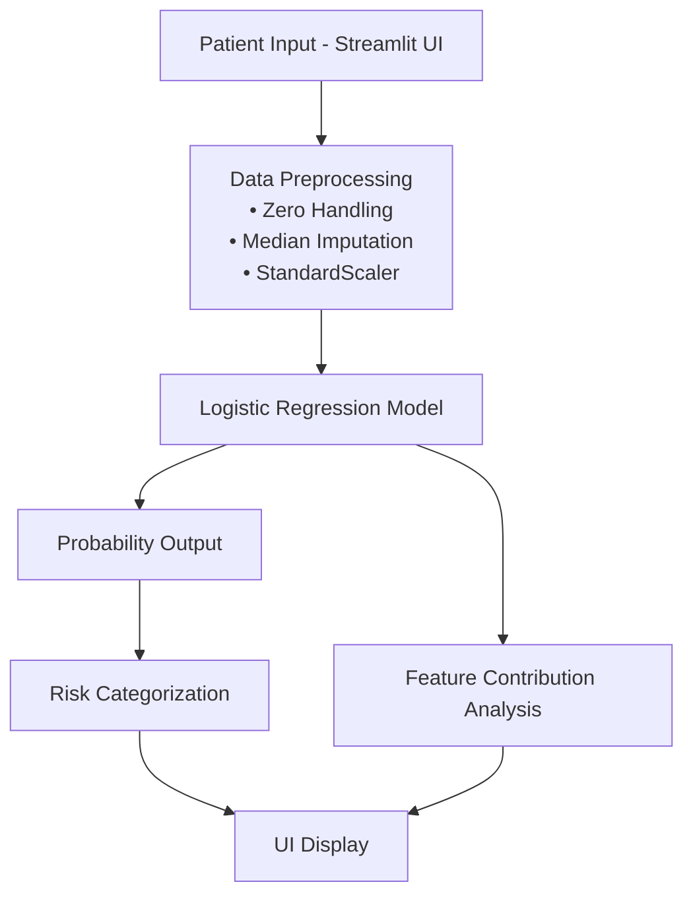

# 🩺 Intelligent Patient Risk Assessment System (Milestone 1)

## 📌 Project Overview

This project implements a Machine Learning-based healthcare analytics system that predicts diabetes risk using structured clinical data.

The system analyzes patient health indicators and provides:

- Risk probability (%)
- Risk category (Low / Moderate / High)
- Top contributing clinical factors

This project fulfills **Milestone 1: ML-Based Patient Risk Assessment**.

---

## 🎯 Problem Statement

Diabetes is a chronic metabolic disorder affecting millions globally. Early risk detection is critical to prevent long-term complications such as cardiovascular disease, kidney failure, and nerve damage.

This system aims to:

- Predict diabetes risk using structured clinical features
- Provide interpretable risk explanations
- Support preliminary screening and preventive care

⚠️ This system is intended for educational purposes only and does not replace professional medical diagnosis.

---

## 📊 Dataset

**Dataset Used:** Pima Indians Diabetes Dataset  
Source: Kaggle / UCI Machine Learning Repository  

### Features:

- Pregnancies
- Glucose
- BloodPressure
- SkinThickness
- Insulin
- BMI
- DiabetesPedigreeFunction
- Age

### Target:
- Outcome (0 = Non-diabetic, 1 = Diabetic)

---

## ⚙️ System Architecture (ML Pipeline)


---

## 🗂️ Project Structure

```
HealthGuard-AI/
│
├── data/                   # Dataset files
├── app.py                  # Streamlit application
├── train.py                # Model training script
├── requirements.txt        # Project dependencies
├── ml_pipeline_uml.md      # UML diagram
└── README.md
```

---

## 🚀 How to Run Locally

### 1️⃣ Clone the Repository

```bash
git clone https://github.com/your-username/HealthGuard-AI.git
cd HealthGuard-AI
```

---

### 2️⃣ Create Virtual Environment

```bash
python3 -m venv .venv
```

---

### 3️⃣ Activate Virtual Environment

**Mac / Linux**

```bash
source .venv/bin/activate
```

**Windows**

```bash
.venv\Scripts\activate
```

---

### 4️⃣ Install Dependencies

```bash
pip install -r requirements.txt
```

---

### 5️⃣ Train the Model

```bash
python train.py
```

---

### 6️⃣ Run the Application

```bash
streamlit run app.py
```

---

### 7️⃣ Open in Browser

```
http://localhost:8501
```